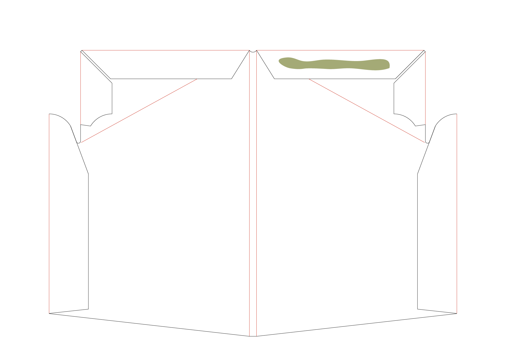

# carton-stand
Portable laptop lifter from corrugated board.

Recommended board thickness: B (3 mm)

## Steps of assemling

### First Step:
Cut out the drawing manually or find some nerby digital die cutting studio. Black lines are cut lines, red lines are crease.

### Step 2:
Glue the side flaps back to the body.

### Step 3:
First bend the top flaps down and add glue on it.

### Final step:
Bend it half by the double crease and glue the two top flaps together.

